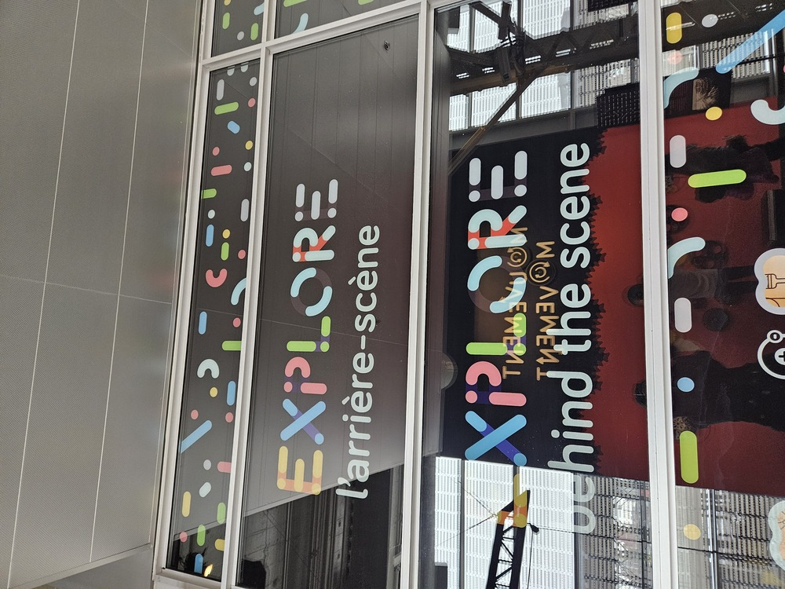
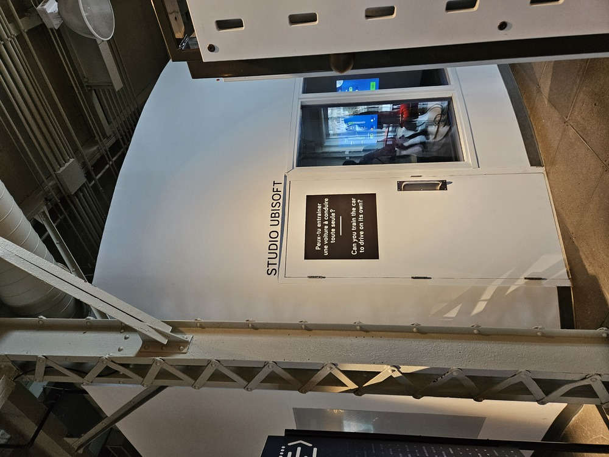
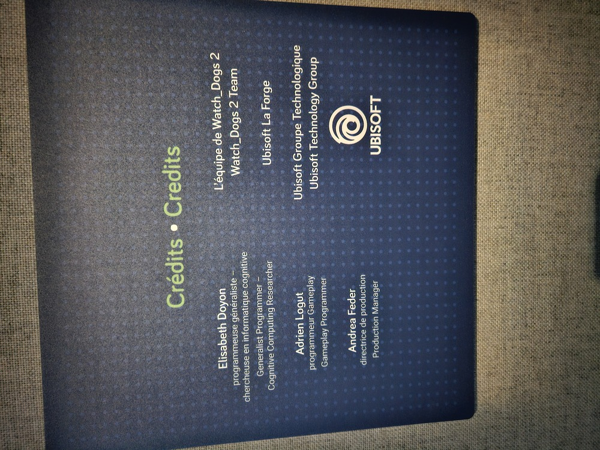
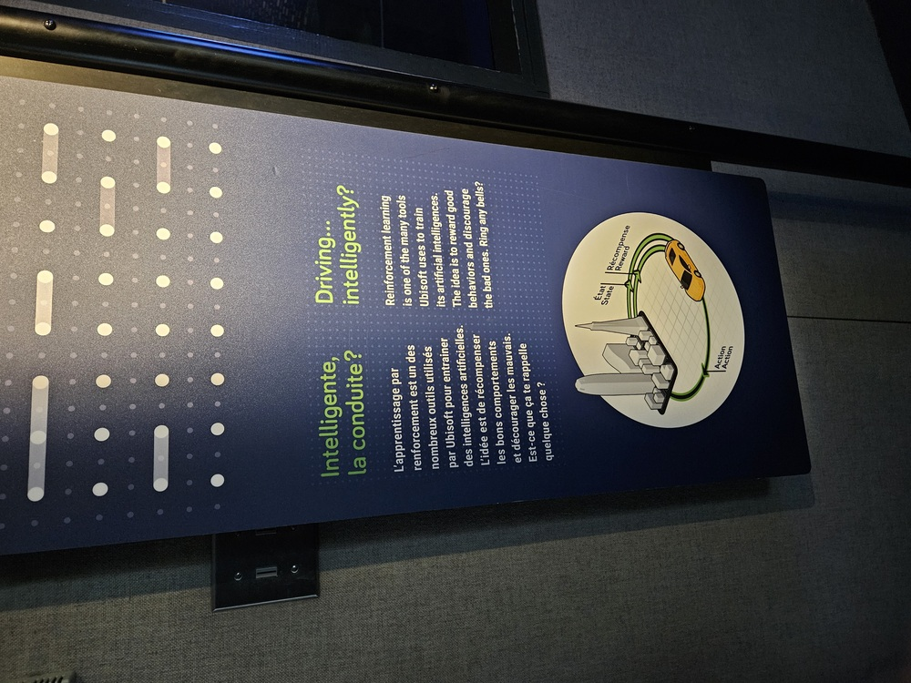
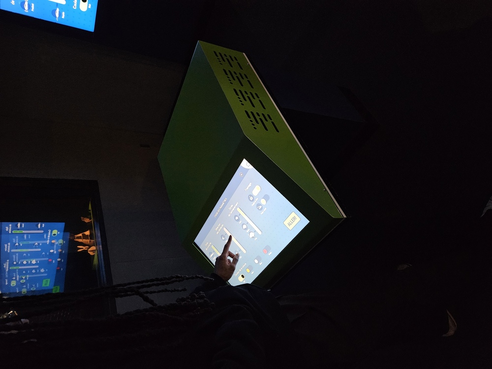
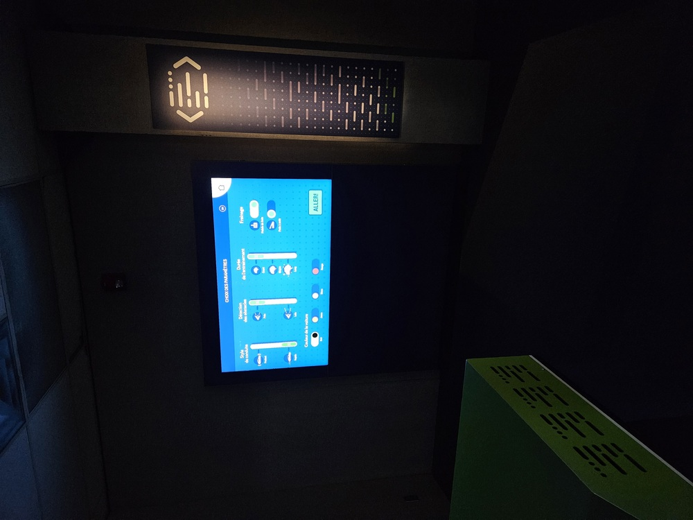

# Explore l'arrière-scène

---

### Lieu de mise en exposition

- 2 De la Commune St W, Montreal, Quebec H2Y 4B2

### Type d'exposition
- Permanent et intérieur

### Date de visite
-  23 avril 2026

### Titre de l'oeuvre
#### - Intelligente, la conduite?

### Nom des créateurs
- Elisabeth Doyon
- Adrien Logut
- Andrea Feder
- L'équipe de Watch_Dogs 2
- Ubisoft La Forge
- Ubisoft Groupe Technologique

### Année de réalisation
- 2026

---

### Description du dispositif
L'apprentissage par renforcemenent est un des nombreux outils utilisés par Ubisoft pour entrainer des intelligences artificielles. L'idée est de récompenser les bons comportements et décourager les mauvais. Est-ce que ça te rappelle quelque chose?

### Type d'installation
- Interactive

---

### Fonction du dispositif multimédia
Le but du dispositif est d'approfondir sur l'importance de conduire de façon sécuritaire. En choisissant des options plus rapides et risquées, la voiture rentre en collision avec le monde et cause des accidents.

---

### Mise en espace
![Plan]

---

### Composantes et techniques 

---

### Éléments nécessaires à la mise en exposition
- Lumières
- Écran
- Écran tactile

---

### Expérience vécue
On rentre dans une salle sombre. Quelques lumières sont dans la salle pour luminer quelques coins de la salle. Il y a deux écrans, un tactile pour l'utilisateur. L'utilisateur peut manier cet écran tactile pour définir les paramètres que la voiture dans la simulation va entreprendre. On voit ainsi les mouvements de la voiture selon ce que l'utilisateur a choisi.

---

### Ce qui m'a plu, m'a donné des idées
J'ai aimé la présentation ou bien la mise en place des éléments. Le parcours de l'utilisateur est positivement intuitif. À cause que la luminosité est contrôlé, les écrans sont bien visibles.

### Aspect que je ne souhaiterais pas retenir pour mes propres créations ou que vous feriez autrement
Desfois, des paramètres sur l'écran tactile n'étaient pas faciles à comprendre, car on ne savait pas c'était quoi le résultat qu'on s'attendait à, alors peut-être des instructions ou des définitions quelque part.

---

### Références

https://siecledigital.fr/2019/12/30/ubisoft-appris-voiture-conduire-seule-jeu-de-course/

https://www.youtube.com/watch?v=bmrNMDEkPyQ&feature=youtu.be