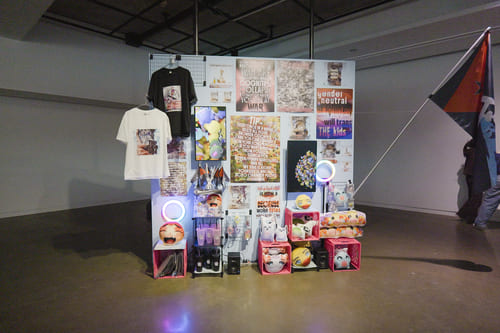
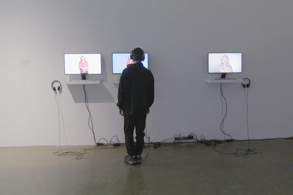
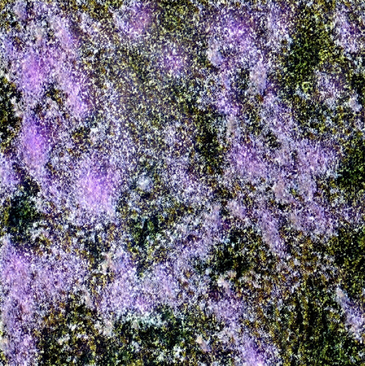
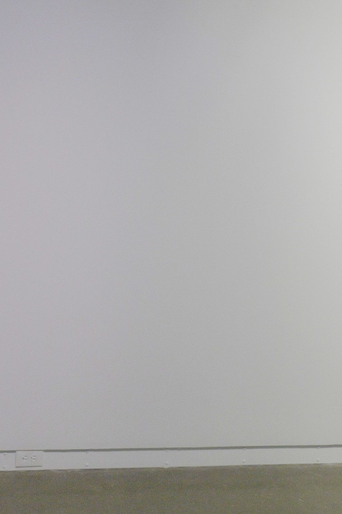
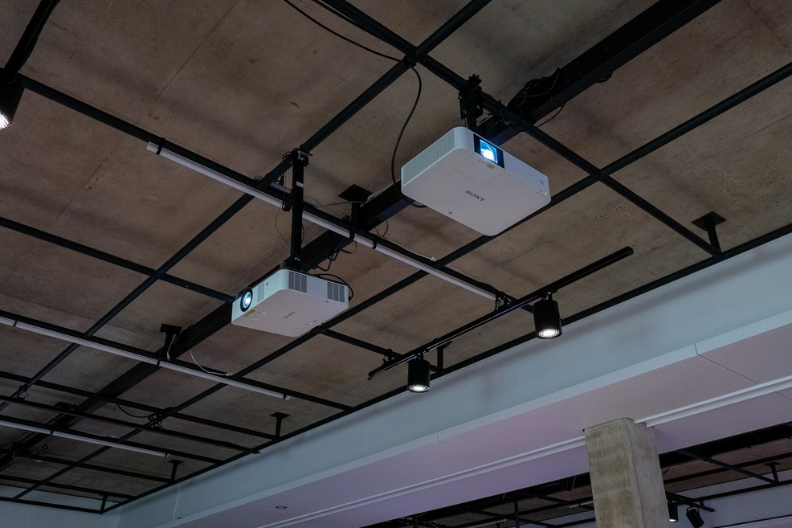
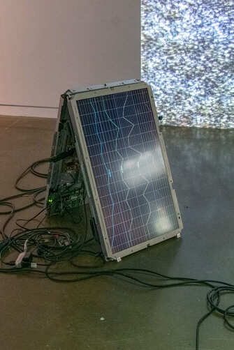
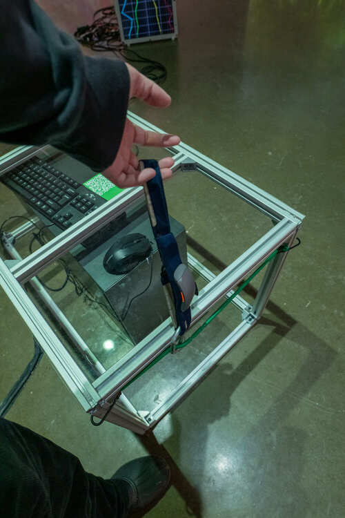
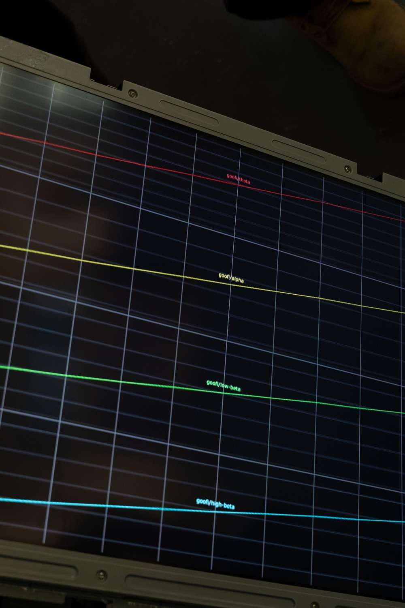
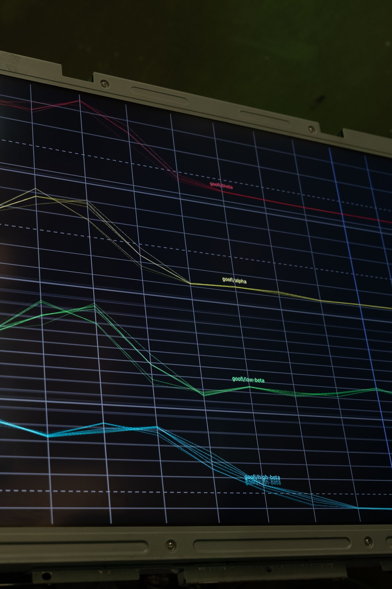

# TP1 - Visite d'une exposition à la Galerie de l'Université de Montréal

## Exposition - Devenirs Partagés. Pratiques de l'IA

---
- **Lieu :** Galerie de l'Université de Montréal
- **Date :** 29 janvier 2026
- **Type d'exposition:** Temporaire et intérieur

---

### Trajet de l'exposition

En entrant dans la salle, on peut voir l'ensemble des oeuvres et dispositifs. Il y en a 4 au total. Le parcours se fait dans un sens antihoraire.

---

### Oeuvre 1 

La première oeuvre, située à droite, est «Terre Commune» de Marion Schneider. C'est l'oeuvre que j'ai choisie pour ma fiche.

---

### Oeuvre 2

À côté se trouve l'oeuvre de Marie-Ève Levasseur, intitulée «Techno-Compost 01 (Décomposition) / Techno-Compost 02 (le bruit RVB et l'espace latent en tant que jardin)».

---

### Oeuvre 3

À sa gauche, celle de Francisco González-Rosas, nommée «SlopPsyopRealism (abonnez-vous $VP)».

---

### Oeuvre 4

Finalement, en suivant le parcours dans un sens anti-horaire, on arrive à l'oeuvre de Dayna McLeod, «Queer. Veuve. Cancer.»

---

## Oeuvre choisie - Terre Commune / Common Ground

###### Image provenant du site web Ada X

- **Artiste :** Marion Schneider
- **Date :** 2025
- **Type d'installation :** Interactive
  
### Description
Marion Schneider cherche à relier l'écosysteme, les humains et l'intélligence artificielle. À travers cette oeuvre, elle a collecté plusieurs photographies de sols forestiers pour ensuite entraîner un modèle avec cette banque d'images. Elle souhaite favoriser la coexistence de ces trois «espèces», ce qui est reflétée dans le titre de son oeuvre.
  
---
  
### Mise en espace

L'installation se déroule à l'intérieur à l'aide d'un support fixé au plafond pour le projecteur, d'un mur blanc pour mettre les images par-dessus ainsi qu'une source d'alimentation électrique. Il y a un écran placé verticalement sur le sol, près du mur. Les ondes cérébrales et les images générées sont visibles dans le champ de vision de l'utilisateur pendant son expérience. Il faut une espace pour s'asseoir afin de simuler un état de détente. À l'exposition, une table était mise en place au dessus de l'ordinateur pour que l'utilisateur puisse s'asseoir.

On peut voir la mise en place de ces équipements avec mes croquis ci-dessous.

#### Plan

#### Vue Cavalière

  
  
---
  
### Composante et technique
#### Composante
L'oeuvre consiste de deux éléments principaux:
- L'image qui est généré par l'IA ;
- Les ondes cérébrales alpha et bêta que le visiteur peut voir durant son expérience.
Il n'y a pas d'audio présent.

#### Technique
L'artiste a fourni un grand nombre d'images que l'IA utilise pendant sa génération visuelle. L'image est sélectionnée et modifiée selon les données cérébrales captées chez l'utilisateur. Cela est possible avec le logiciel goofi-pipe pour la conversion de données.
  
---
  
### Éléments necessaires à la mise en exposition
Voici les équipements principaux visibles lors de la visite:

- #### **Ordinateur**

- #### **Mur blanc**

- #### **Projecteur**

- #### **Moniteur**

- #### **Casque EEG**

- #### **Alimentation électrique**

- #### **Logiciel goofi-pipe**

---

Ensuite, voici ceux qui sont moins visibles durant la visite.

- Extrusions d'aluminium
- Acrylique
- Les images que l'artiste a collecté lors de ses balades autour du Lac Forget dans les Laurentides
- Modèle StyleGAN
- Logiciel Autolume
- Logiciel TouchDesigner
- Logiciel MuseLsl
  
---
  
### Expérience vécue
Pour débuter l'expérience, l'utilisateur doit porter un casque EEG et s'asseoir afin de simuler un état de repos que l'oeuvre cherche à solliciter. Pour confirmer cet état, le visiteur peut voir que ses ondes sont stables sur un écran qui démontrent ces données. L'image qu'il pourra voir change selon ce qu'il ressent émotionellement. S'il est plus actif, ses ondes seront plus mouvementées et l'image qui sera mis sur le mur changera.

---

Voici une image des ondes statiques d'une personne en détente.

---

Voici une image des ondes actives d'une personne qui n'est pas en détente.

---

### Ce qui m'a plus

J'ai aimé la présence de l'écran. Cela aide beaucoup lorsqu'on a des retours visuels en temps réels qui nous informe de ce que nos actions font. Le tout était très intuitif a utilisé. C'était facile de savoir qu'il fallait porter un casque, que les ondes sont reliées à nous et que l'image qui se fait projetter change à cause de l'utilisateur.

---

### Ce que je ferais autrement

Je crois que les données que recevaient le casque était desfois incorrecte. Il y avait des fois que les ondes bougeaient beaucoup et s'arrêtaient soudainement pendant qu'il n'y avait personne qui portait le casque. J'utiliserais probablement une méthode plus recherché ou une qui auraient une marge d'inconsistence plus basse. De plus, j'aurais apprecié qu'il y aurait eu un panneau qui nous montrait les images possibles avec chaque état projette comme image. S'il n'y avait pas l'écran qui montre nos ondes, on ne saurait pas à quelle état c'était associé à. Malgré cela, la façon que l'IA choisi ses images étaient relativement vague.

---
  
## References
- [Image d'oeuvre de Marion Schneider](https://www.ada-x.org/activities/common-ground-marion-schneider/)
- [Site web de l'exposition](https://galerie.umontreal.ca/devenirs-partagees-pratiques-de-lia.php)
- [Site web de l'artiste](https://schneidermarion.net)

