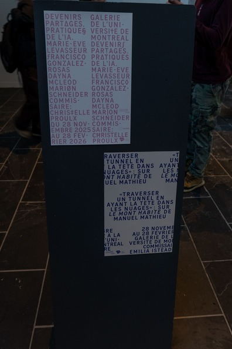
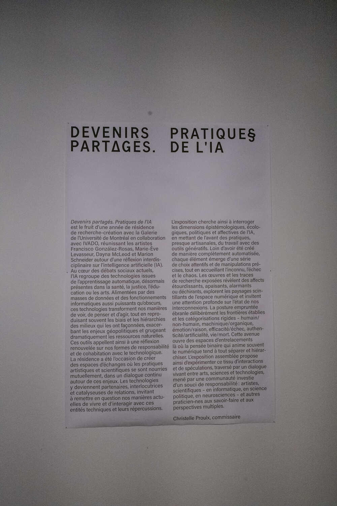
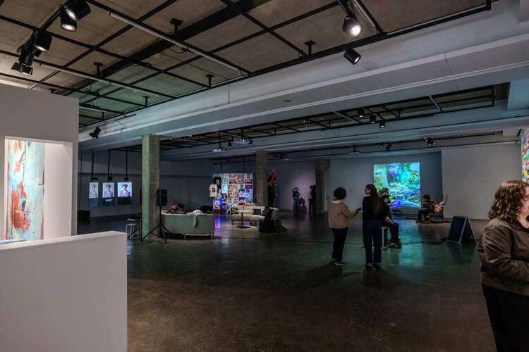
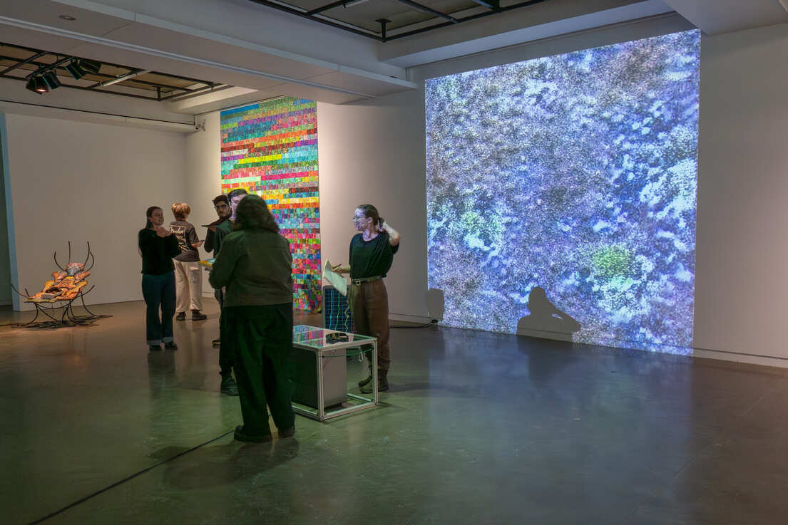
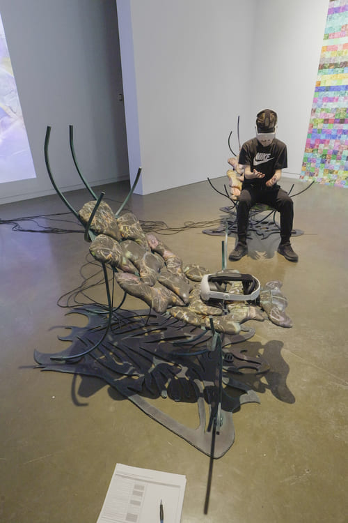
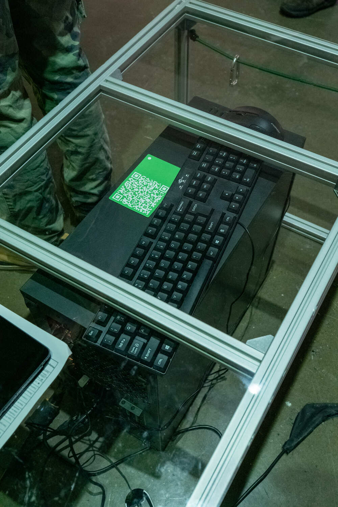
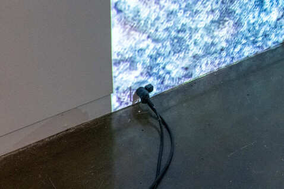
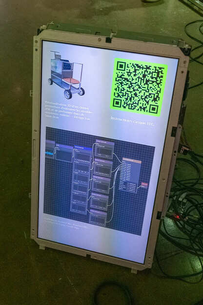

# TP1 - Visite d'une exposition à la Galerie de l'Université de Montréal

## Exposition - Devenirs Partagés. Pratiques de l'IA

---
- **Lieu :** Galerie de l'Université de Montréal
- **Date :** 29 janvier 2026
- **Type d'exposition:** Temporaire et intérieur
- 
---

### Trajet de l'exposition

En entrant dans la salle, on peut voir toutes les oeuvres et dispositifs. Il y en a 4 totals. Il faut marcher dans un sens anti horaire durant le parcours. La première oeuvre, à la droite, est «Terre Commune» par Marion Schneider. Celle-là est l'oeuvre que j'ai choisie de faire ma fiche sur.
### Oeuvre 1 

À côté, il y a l'oeuvre de Marie-Ève Levasseur, titulée «Techno-Compost 01 (Décomposition) / Techno-Compost 02 (le bruit RVB et l'espace latent en tant que jardin)».

À sa gauche, celle de Francisco González-Rosas, nommée «SlopPsyopRealism (abonnez-vous $VP)».

Finalement, toujours en marchant dans un sens anti-horaire, on y arrive à l'oeuvre de Dayna McLeod, qui est nommée «Queer. Veuve. Cancer.»

---

## Oeuvre choisie - Terre Commune / Common Ground
- **Artiste :** Marion Schneider
- **Date :** 2025
- **Type d'installation :** Interactive
  
### Description
L'utilisateur porte un casque EEG pour lire ses ondes cérébrales, ceux liées à la méditation et au sommeil. Il doit rester statique, idéalement dans un état assis pour que ses ondes soient bien lues. L'IA de l'oeuvre génère des images de sols forestiers que Marion l'a procuré. Il y a une projecteur qui projette ces images sur un mur blanc. Pour alimenter tout cela, il faut un ordinateur qui charge les données en temps réel à l'aide du logiciel goofi-pipe. L'utilisateur peut voir ses ondes alpha et beta avec un écran qui est mis verticalement sur le sol, dans son champ de vision avec les images d'IA.
  
---
  
### Mise en espace

Le tout se fait à l'intérieur à l'aide d'un support sur le plafond pour le projecteur, d'un mur blanc pour mettre les images par-dessus et d'une source d'alimentation électrique. Il y a un écran qui est mis verticalement sur le sol près du mur. Les ondes et les images sont visibles dans le champ de vision de l'utilisateur lorsqu'il fait son expérience. Il y faut aussi une place pour s'asseoir pour simuler la détention. À l'exposition, une table était mise en place au dessus de l'ordinateur pour que l'utilisateur puisse s'asseoir. Il serait possible de le faire à l'extérieur avec la présence d'une chaise, d'une surface pour imposer les images et possiblement une source d'électricité portable. 
  
---
  
### Composante et technique
#### Composante
L'oeuvre consiste de deux composantes, l'image qui est généré par l'IA et les ondes alphas et betas que le visiteur peut voir durant son expérience. Il n'y a pas d'audio présent. 
#### Technique
L'artiste a procuré beaucoup d'images que l'IA utilise comme projection. L'image qui sera présentée est choisie selon les données qu'il lit à partir des ondes de l'utilisateur. Cela est atteint avec le logiciel goofi-pipe pour la conversion de données. On peut voir le processus avec l'image insérée ci-dessous.
  
---
  
### Éléments necessaires à la mise en exposition
Il y a une longue liste d'équipements dont l'oeuvre utilise, mais voici ceux qu'on pouvait facilement distinguer.

- Ordinateur

- Mur blanc
[Mur](media/
- Projecteur
- Moniteur
- Casque EEG

- Alimentation électrique

- Logiciel goofi-pipe

On peut voir la mise en place de ces
équipements avec mes croquis ci-dessous.

#### Plan

#### Vue Cavalière

  

Ensuite, voici ceux qui sont moins visibles durant la visite.

- Extrusions d'aluminium
- Acrylique
- Les images que l'artiste a collecté lors de ses balades autour du Lac Forget dans les Laurentides
- Modéle StyleGAN
- Logiciel Autolume
- Logiciel TouchDesigner
- Logiciel MuseLsl
  
---
  
### Expérience vécue
Pour commencer, l'utilisateur porte un casque EEG. Il doit s'asseoir afin d'être en état repos, similaire à la méditation et au sommeil que l'oeuvre vise chercher. Pour qu'il sache qu'il est réellement dans cet état, le visiteur peut voir que ses ondes sont stables sur un écran qui démontrent ces données. L'image qu'il pourra voir change selon ce qu'il ressent émotionellement. S'il est plus actif ou stressé, ses ondes seront plus mouvementées et l'image qui sera mis sur le mur changera selon cela.
  
---
  
## References
[Site web de l'exposition](https://galerie.umontreal.ca/devenirs-partagees-pratiques-de-lia.php)
[Site web de l'artiste](https://schneidermarion.net)

