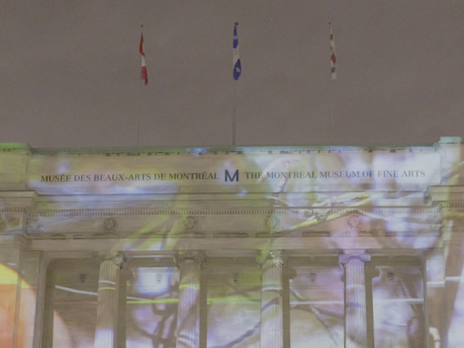
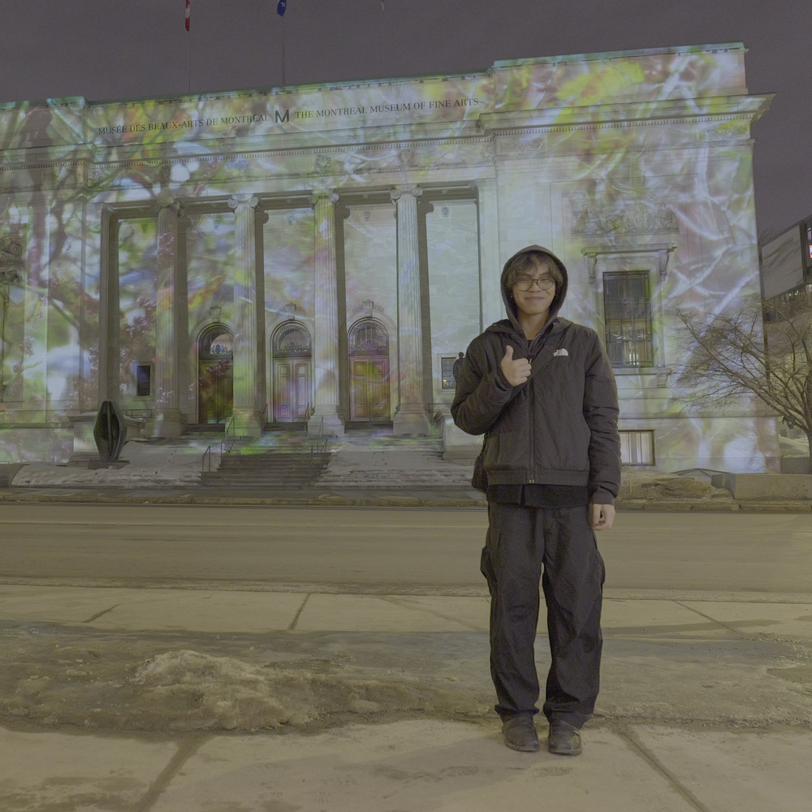
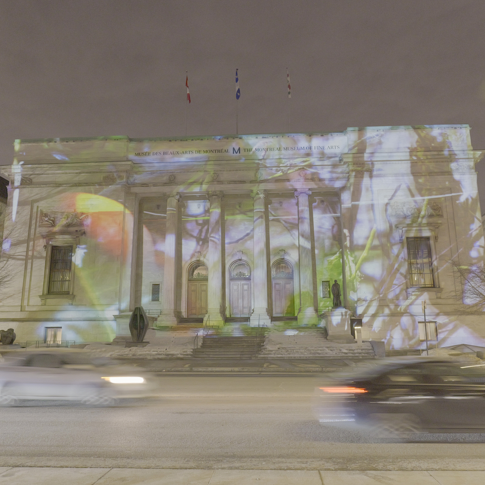
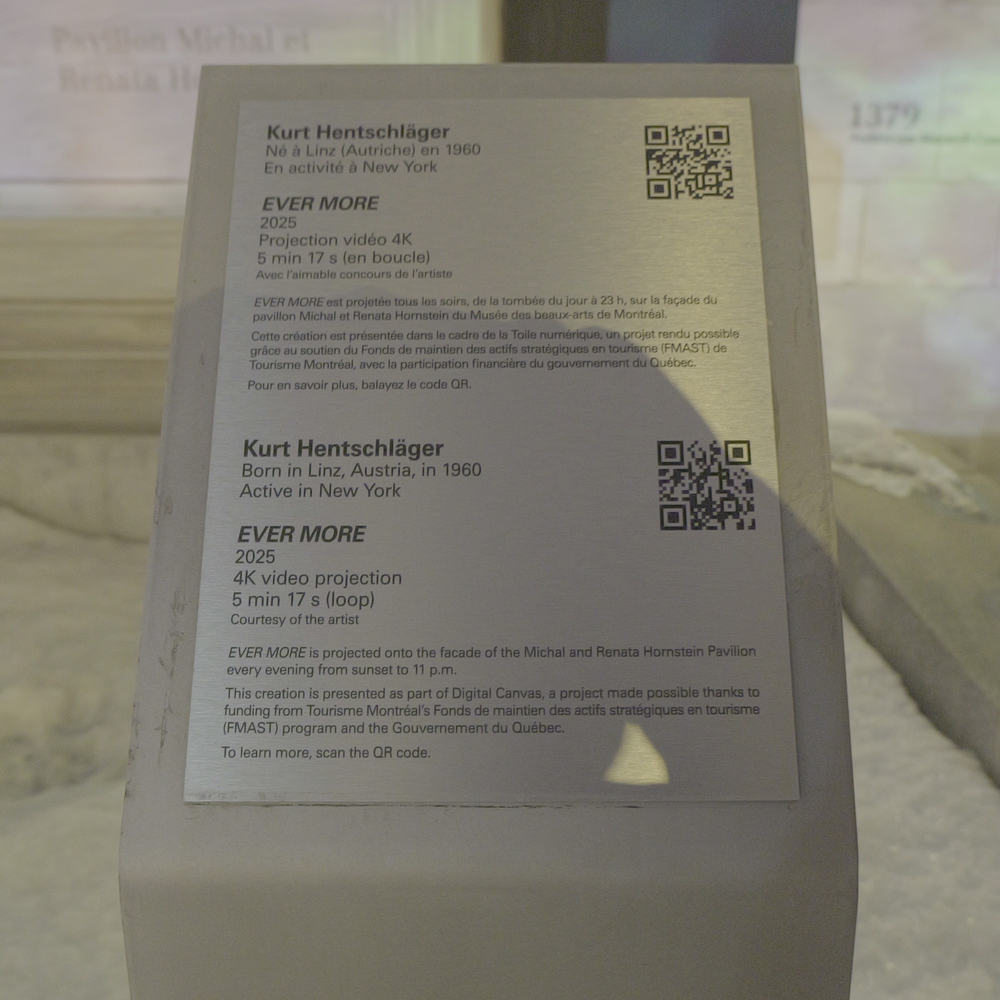
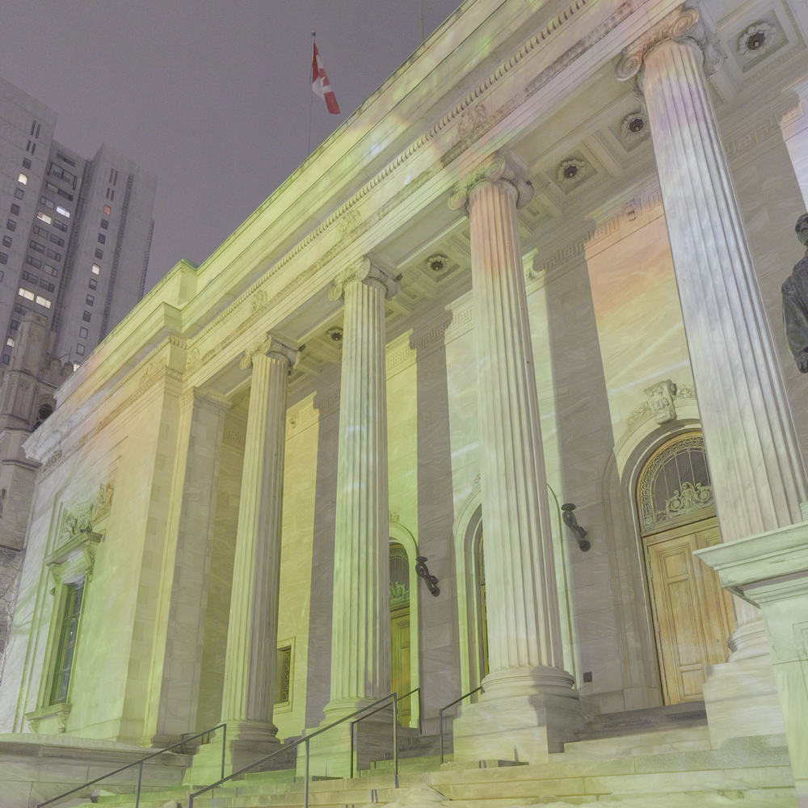
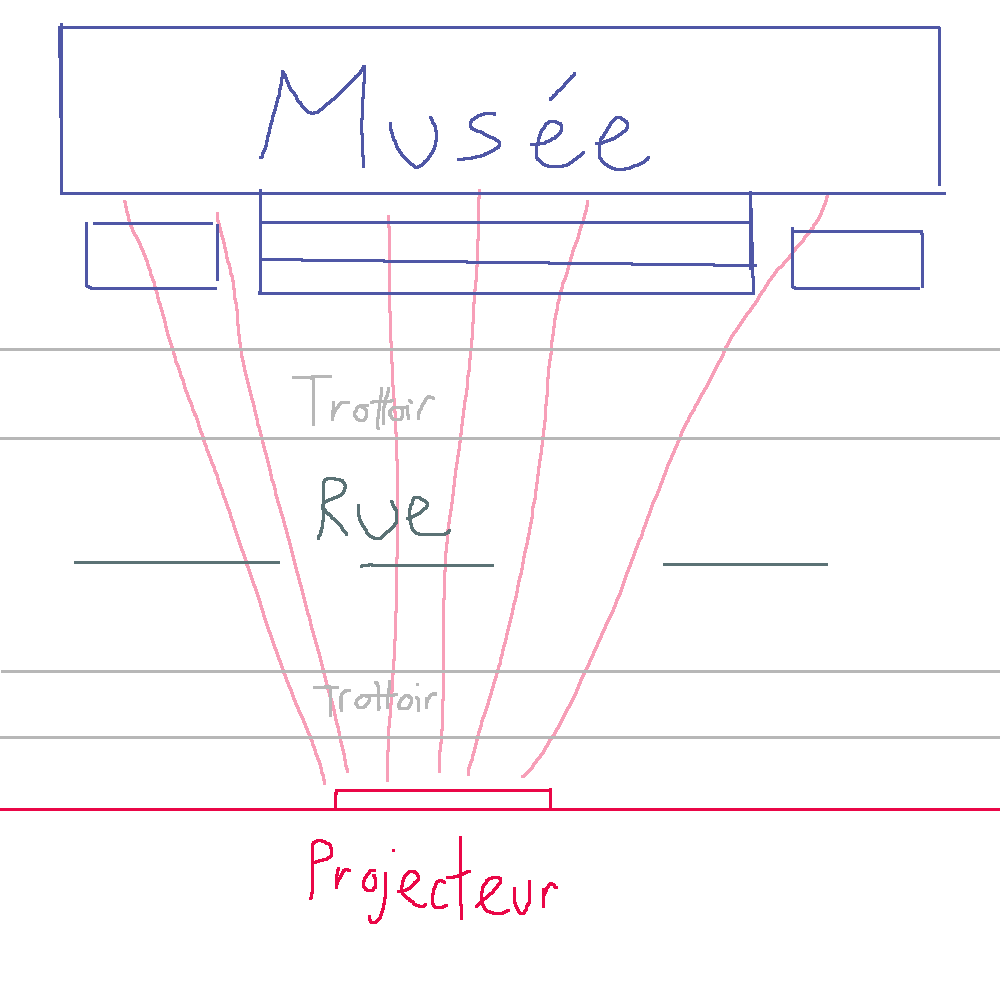
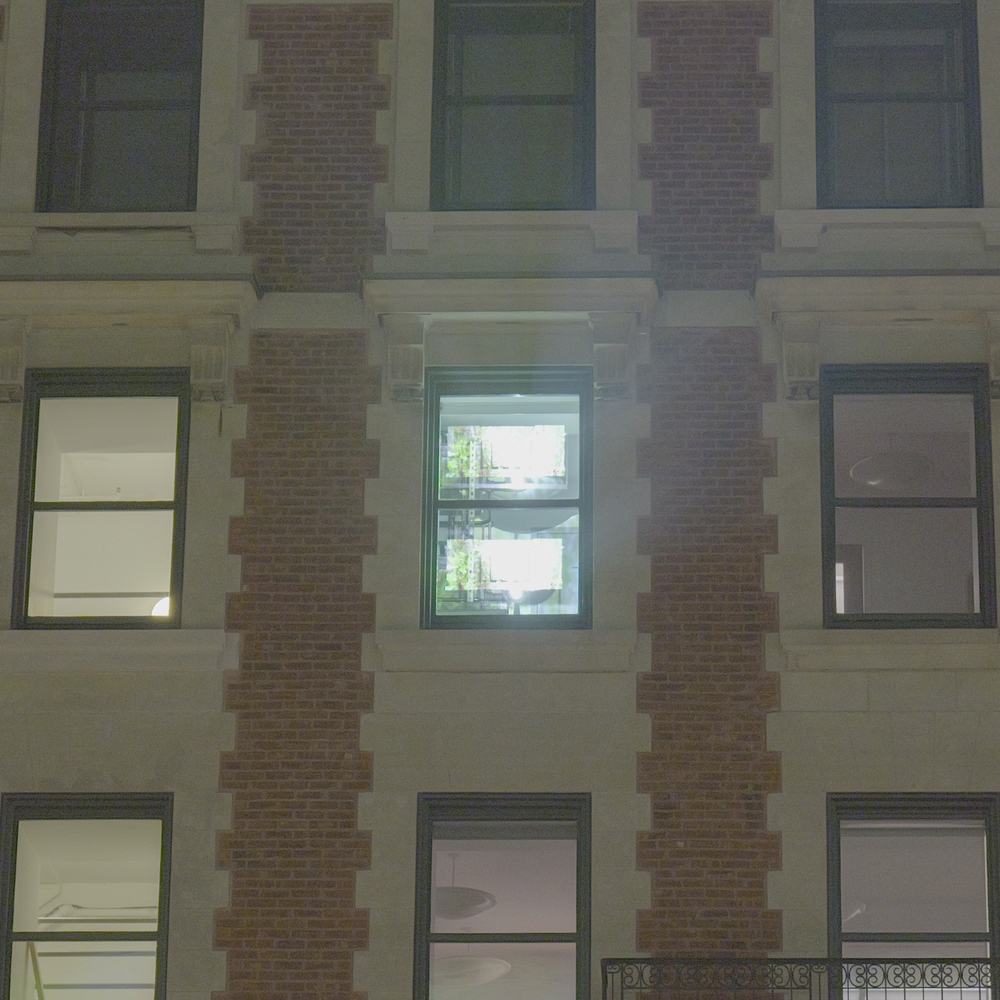

# EVER MORE - Commission pour le canvas digital du MBAM

### Lieu
Musée des Beaux-Arts de Montréal, 1380 rue Sherbrooke West, Montréal
### Type d'exposition
Temporaire (du coucher du soleil jusqu'à 23h) et extérieure. L'oeuvre demeure jusqu'au 5 avril 2026.
### Date de visite
6 mars 2026

--- 

#### Moi devant l'oeuvre

---

### Nom de l'oeuvre
EVER MORE
### Nom de l'artiste
Kurt Hentschläger
### Année de réalisation
2025

### Description de l'oeuvre

Dans EVER MORE, Kurt Hentschläger explore l'émergence d'une nature hybride - une amalgation des éléments physiques et virtuelles qui se mélangent parfaitement. Des enregistrements vidéo de plantes et de fleurs sauvages des prairies du Michigan, montés, animés et composés, sont entrecoupés d'effets de synthèse 3D, d'éclairages et de paysages.

Cette nature mouvante,

In EVER MORE, he explores the emergence of a hybrid nature-an amalgamation of physical and virtual elements that blend together seamlessly. Edited, animated, and composited video recordings of wild plants and flowers from the Michigan prairies are interwoven with effects, lighting and 3D- synthesized landscapes.

Ce caractère mouvant, qui pourrait suggérer une célébration du monde physique, masque en réalité l'exploitation, l'épuisement et l'accélération de la destruction des habitats naturels à travers le monde.¹

https://www.mbam.qc.ca/en/news/evermore/

--À composer ou reprendre la description offerte sur le site de l'artiste ou sur le cartel en indiquant bien sa source

Type d'installation (contemplative, immersive, interactive)

Contemplative

Fonction du dispositif multimédia (scénographie, mise en valeur, mise en contexte, support pédagogique, diffusion du patrimoine immatériel)

[Vue descriptive - vidéo OU photo qui nous permet de bien comprendre la fonction du dispositif multimédia]

Mise en espace

Composantes et techniques 
[Parties composantes de l'oeuvre ou du dispositif (il est possible d'utiliser des images tirées de sites internet pour faciliter la compréhension si les photos prises ne sont pas claires)]

Éléments nécessaires à la mise en exposition

Expérience vécue
Texte qui explique ce qui est attendu du visiteur ou de l'interacteur. Où et comment se positionne-t-il/elle? Que faut-il faire? Comment réagit l'oeuvre ou le dispositif (si interactivité)? Plus personnellement, description de l'expérience que l'oeuvre ou le dispositif vous a fait vivre.

❤️ Ce qui vous a plu, vous a donné des idées
Texte à rédiger qui présente un ou des aspects inspirants, avec justifications détaillées (pourquoi est-ce que cela vous a plus/ vous a donné des idées ?

Aspect que vous ne souhaiteriez pas retenir pour vos propres créations ou que vous feriez autrement
Texte à rédiger qui présente un ou des aspects que vous ne retiendriez pas ou feriez autrement, avec justifications détaillées (pourquoi? comment?)

Références
¹ Musée des Beaux-Arts de Montréal, Kurt Hentschläger : EVER MORE, 2025, https://www.mbam.qc.ca/fr/expositions/kurt-hentschlager-ever-more/
