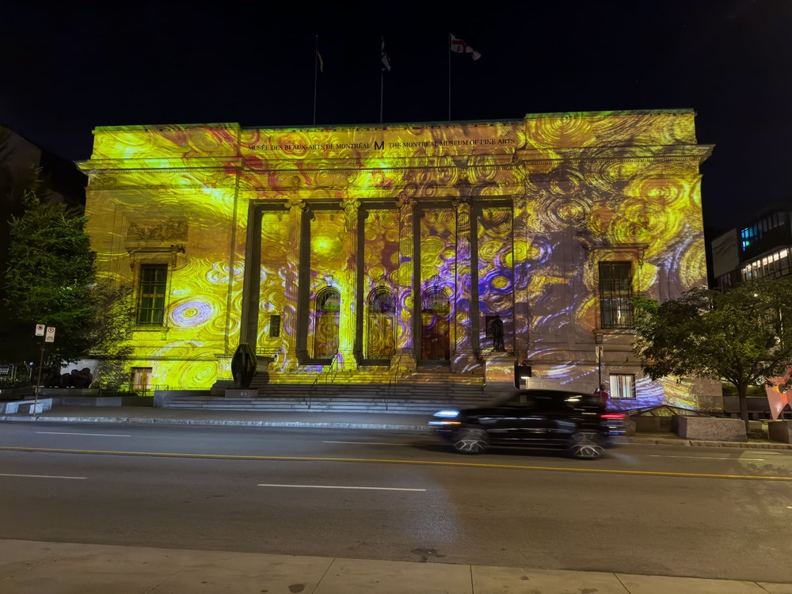
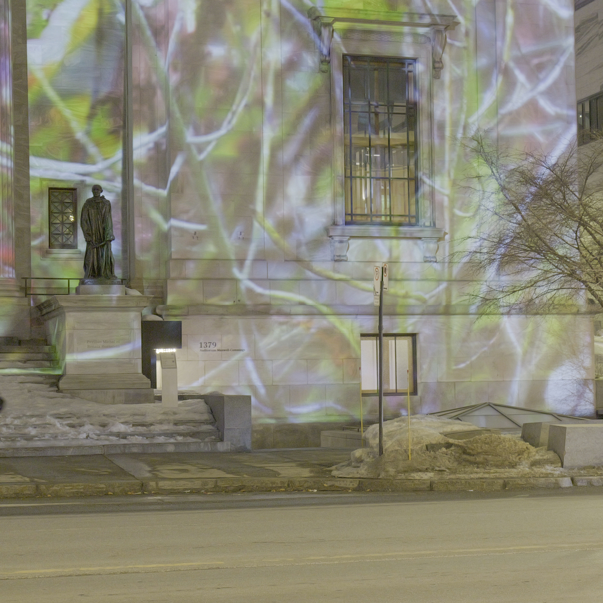
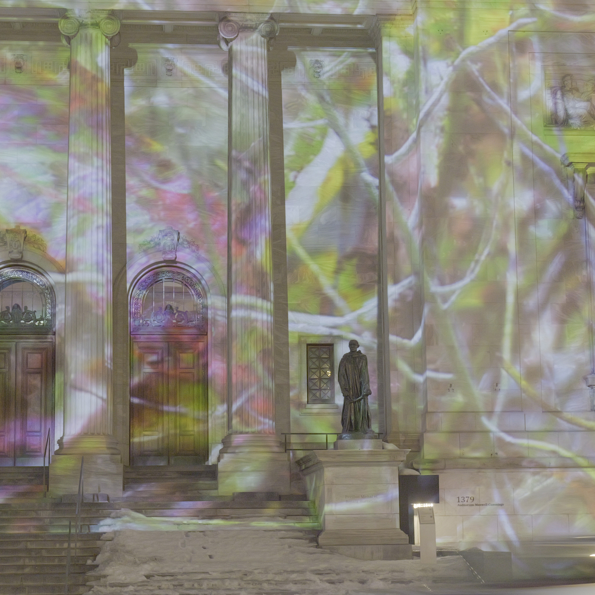

# EVER MORE - Commission pour le canevas digital du MBAM

###### Image du site web de l'artiste ¹
---
### Lieu
Musée des Beaux-Arts de Montréal, 1380 rue Sherbrooke West, Montréal
### Type d'exposition
Temporaire (du coucher du soleil jusqu'à 23h) et extérieure. L'oeuvre est présentée jusqu'au 5 avril 2026.
### Date de visite
6 mars 2026

--- 

#### Moi devant l'oeuvre

---

### Nom de l'oeuvre
EVER MORE
### Nom de l'artiste
Kurt Hentschläger

#### Description de l'artiste
Kurt Hentschläger est un artiste autrichien qui vie présentement à New York. Les installations qu'il réalise prennent place dans l'espace physique ainsi que virtuel. Il privilégie l'expérimentation et une approche interdisciplinaire dans son travail, ce qu'on peut voir avec ses installations audiovisuelles éphèmères et ses performances alliant art, musique et théâtre. De 1992 à 2003, il faisait partie de GRANULAR≈SYNTHESIS, un duo à l'avant-garde des arts médiatiques. De 2013 à 2018, il a enseigné à la School of the Art Institute of Chicago.²

Kurt Hentschläger a eu la possibilité de réaliser cette oeuvre 

### Année de réalisation
2025

### Description de l'oeuvre
Dans EVER MORE, Kurt Hentschläger explore l'émergence d'une nature hybride - une amalgamation des éléments physiques et virtuels qui se mélangent parfaitement. Des enregistrements vidéo de plantes et de fleurs sauvages des prairies du Michigan, montés, animés et composés, sont entrecoupés d'effets de synthèse 3D, d'éclairages et de paysages.³

Ce caractère mouvant, qui pourrait suggérer une célébration du monde physique, masque en réalité l'exploitation, l'épuisement et l'accélération de la destruction des habitats naturels à travers le monde.³

L'oeuvre est une vidéo d'une durée de 5 minutes et 17 secondes. Elle joue en répétition à une résolution de 4K.

### Type d'installation
Contemplative

---

### Fonction du dispositif multimédia
L'artiste utilise le musée comme canevas. C'est grâce à cela que l'on peut voir l'oeuvre qu'il désire présenter. Il doit aussi y avoir une absence de lumière, qui est dans ce cas le soleil, pour que le tout soit visible.

---

### Mise en espace
Pour voir l'oeuvre, il faut se mettre à l'autre bord de la rue du musée. Il y a deux projecteurs par dessus qui joue une vidéo sur le complet du musée. 

---

### Composantes et techniques 
Il n'y a que deux composantes différentes visibles dans cette oeuvre. Ce sont le musée comme canevas et les projecteurs pour projetter l'image. Il est très fortement probable qu'il y a un ordinateur connectée aux projecteurs pour que la vidéo joue, mais on ne peut pas le voir. L'artiste a dû utilisé un grande espace, notamment la longueur d'une rue, pour pouvoir jouer la vidéo sur le musée complet. Il devait aussi prendre au compte que son canevas n'est pas une surface plate. Il devait s'assurer que la vidéo ne déborde pas du plan du musée et qu'il n'y avait pas de déformations possible avec les piliers qui sont en forme cylindriques.

---

### Éléments nécessaires à la mise en exposition
Il y a deux projecteurs installés dans une chambre qui projette la vidéo sur le musée à travers une fenêtre. L'autre élément est le musée pour se servir comme canevas au projection.

---

### Expérience vécue
Pour faire l'expérience de l'oeuvre, il faut se placer sur la rue de l'autre bord du musée. Le visiteur peut aussi regarder une vidéo de 5 minutes qui est jouée sur le musée. S'il est trop proche, il ne voit pas le tout. Ce point de vue est illustré avec l'image d'en haut.

---

### Ce qui m'a plu ou m'a donné des idées
J'ai trouvé intéressant le moyen que l'artiste entreprend pour pouvoir animer le musée. Il devait utiliser deux projecteurs pour éviter les aberrations physiques sur la façon que sa vidéo serait projettée.

---

### Aspect que vous ne souhaiteriez pas retenir pour vos propres créations ou que vous feriez autrement
Il n'y pas d'instruction ou de moyen intuitif de savoir ce que l'artiste voulait qu'on expérience. La cartel n'explique pas beaucoup. Il se peut aussi que les conditions météorologiques au moment que j'ai visité n'était pas favorable pour la visualisation.

## Références

¹ Kurt Hentschläger, « EVER MORE (2025) », 2025, https://kurthentschlager.com/EVER-MORE-2025

² Musée des Beaux-Arts de Montréal, « Kurt Hentschlager EVER MORE », 2026, https://www.mbam.qc.ca/fr/expositions/kurt-hentschlager-ever-more/

³ Musée des Beaux-Arts de Montréal, « Une œuvre de Kurt Hentschläger pour la Toile numérique », 9 octobre 2025, https://www.mbam.qc.ca/fr/actualites/evermore

### Consultation
https://www.mbam.qc.ca/fr/actualites/evermore
https://www.mbam.qc.ca/fr/expositions/kurt-hentschlager-ever-more/
https://kurthentschlager.com/EVER-MORE-2025
