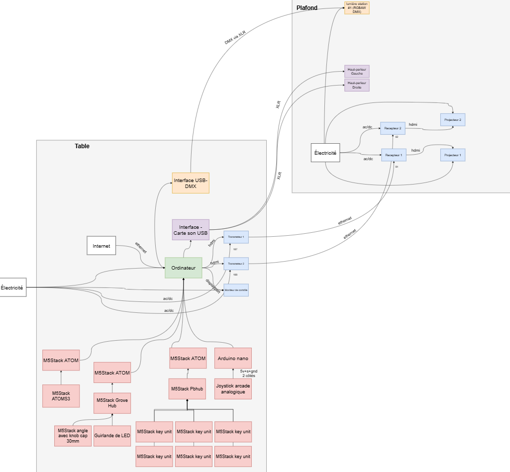
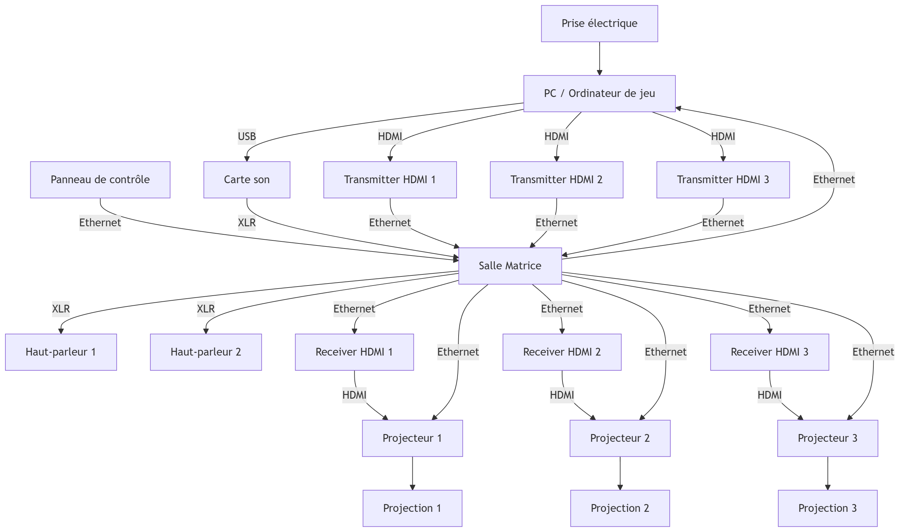
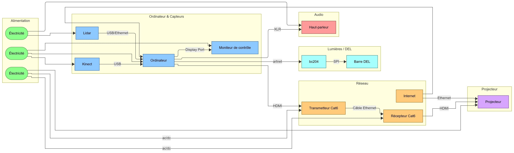

# Symbiose

### Ordre de préférence

- 1

### Noms des créateurs et créatrices

- Yannick Chamberland
- Benjamin Ferland
- Ryan Dufault
- Walid Cheour
---
### Installation

### Schéma de l'installation prévue

###### ¹ Synoptique de Symbiose 

### Ce que je ressents en expérimentant

J'ai trouvé le concept très intéressant, surtout car il nécessite de la coopération avec les autres joueurs. J'ai aimé que les manettes pour jouer à un jeu ne sont pas traditionnelles, mais plutôt des outils scientifiques, comme l'erlenmeyer.

### 3 cours du programme qui me semble incontournable pour avoir les compétences pour créer ce genre de projet

- Objets interactifs
- Traitement audiovisuel
- Interactivité ludique

### Une composante technogique qui est utilisée dans ce projet et que je ne connaissais pas

- Arduino Nano

---

# Mission décollage 

### Ordre de préférence

- 2

### Noms des créateurs et créatrices

- Ahmed Kaissoumi
- Radhouane Kordan
- Justin Montpetit
- Thearylou Lach
- Jad Saloumi

---

### Installation

### Schéma de l'installation prévue

###### ² Synoptique de Mission décollage

### Ce que je ressents en expérimentant 
Vue le grand plan que ce dispositif prend, il y a quand même un peu d'information a absorber. J'ai aimé l'aspect social où que c'est nécessaire de se communiquer pour accomplir des tâches.

### Nommer 3 cours du programme qui me semble incontournable pour avoir les compétences pour créer ce genre de projet

- Modélisation 3D
- Interactivité ludique
- Installation multimédia

### Nommer une technique ou une composante technogique qui est utilisée dans ce projet et que je ne connaissais pas

- Pure Data

---

### Ordre de préférence

- 3

### Titre du projet

- Arbre en face

### Noms des créateurs et créatrices

- Alexandre Gendron
- Mikael Arseneau
- Mathieu Willett
- Matis Ghariani
- Rafael Angon Dube

### Installation

### Schéma de l'installation prévue

###### ² Synoptique d'Arbre en face

### Ce que je ressents en expérimentant chacune des installations, avec justifications

### Nommer 3 cours du programme qui me semble incontournable pour avoir les compétences pour créer ce genre de projet

### Nommer une technique ou une composante technogique qui est utilisée dans l'un des projets et que vous ne connaissiez pas

---

### Ordre de préférence

- 4

### Titre du projet

- Océan Rouge

### Noms des créateurs et créatrices

- Amira Tounekti
- Kristy Moussally

### Installation en cours (ou finale)
(photo de l'ensemble de l'installation dans le studio)

### Schéma de l'installation prévue

### Ce que je ressents en expérimentant chacune des installations, avec justifications

### Nommer 3 cours du programme qui me semble incontournable pour avoir les compétences pour créer ce genre de projet

### Nommer une technique ou une composante technogique qui est utilisée dans l'un des projets et que vous ne connaissiez pas

---

### Ordre de préférence

- 5 

### Titre du projet

- Quand les yeux se croisent

### Noms des créateurs et créatrices

- Edelwyn Ledru
- Félix Lavoie
- Jade Hébert
- Manel Yaya
- Patricia Nassif

### Installation en cours (ou finale)
(photo de l'ensemble de l'installation dans le studio)

### Schéma de l'installation prévue

### Ce que je ressents en expérimentant chacune des installations, avec justifications

### Nommer 3 cours du programme qui me semble incontournable pour avoir les compétences pour créer ce genre de projet

### Nommer une technique ou une composante technogique qui est utilisée dans l'un des projets et que vous ne connaissiez pas

---

### Références
¹ Équipe Symbiose du Collège Montmorency, « Symbiose », Planification de l'espace - perspective 2D, 2d_plan.webp, 2026, https://les-chimistes.github.io/symbiose/#/technique/?id=synoptique

² Équipe Mission décollage du Collège Montmorency, « Mission décollage », synoptique, synoptique.png, 2026, https://o-i-g-n-o-n.github.io/Mission-decollage/#/technique/?id=synoptique