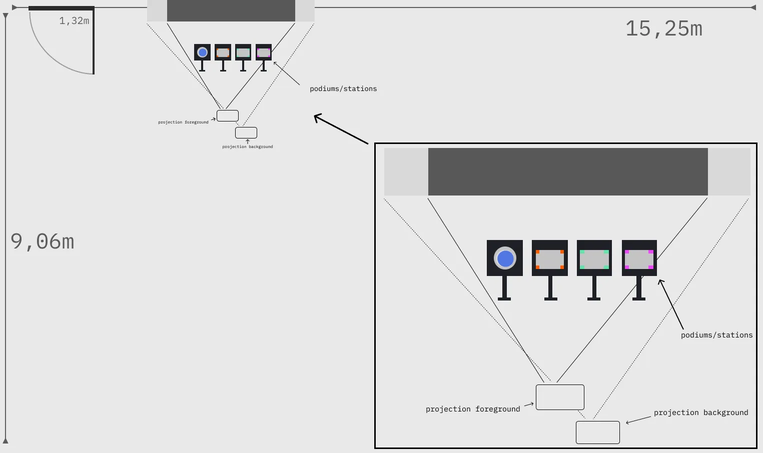

### Ordre de préférence

- 1

### Titre du projet

- Symbiose

### Noms des créateurs et créatrices

- Yannick Chamberland
- Benjamin Ferland
- Ryan Dufault
- Walid Cheour
---
### Installation
(photo de l'ensemble de l'installation dans le studio)

### Schéma de l'installation prévue

###### ¹ Planification de l'espace - perspective 2D 

### Ce que je ressents en expérimentant chacune des installations, avec justifications

J'ai trouvé le concept très intéressant, surtout car il nécessite de la coopération avec les autres joueurs. J'ai aimé que les manettes pour jouer à un jeu ne sont pas traditionnelles, mais plutôt des outils scientifiques, comme l'erlenmeyer.

### 3 cours du programme qui me semble incontournable pour avoir les compétences pour créer ce genre de projet
- Objets interactifs
- Traitement audiovisuel
- Interactivité ludique

### Une composante technogique qui est utilisée dans ce projet et que je ne connaissais pas

- Arduino Nano

---

### Ordre de préférence

- 2

### Titre du projet 

- Mission Décollage

### Noms des créateurs et créatrices

- Ahmed Kaissoumi
- Radhouane Kordan
- Justin Montpetit
- Thearylou Lach
- Jad Saloumi

---

### Installation
(photo de l'ensemble de l'installation dans le studio)

### Schéma de l'installation prévue

### Ce que je ressents en expérimentant chacune des installations, avec justifications

### Nommer 3 cours du programme qui me semble incontournable pour avoir les compétences pour créer ce genre de projet

### Nommer une technique ou une composante technogique qui est utilisée dans l'un des projets et que vous ne connaissiez pas

---

### Ordre de préférence

- 3

### Titre du projet

- Arbre en face

### Noms des créateurs et créatrices

- Alexandre Gendron
- Mikael Arseneau
- Mathieu Willett
- Matis Ghariani
- Rafael Angon Dube

### Installation en cours (ou finale)
(photo de l'ensemble de l'installation dans le studio)

### Schéma de l'installation prévue

### Ce que je ressents en expérimentant chacune des installations, avec justifications

### Nommer 3 cours du programme qui me semble incontournable pour avoir les compétences pour créer ce genre de projet

### Nommer une technique ou une composante technogique qui est utilisée dans l'un des projets et que vous ne connaissiez pas

---

### Ordre de préférence

- 4

### Titre du projet

- Océan Rouge

### Noms des créateurs et créatrices

- Amira Tounekti
- Kristy Moussally

### Installation en cours (ou finale)
(photo de l'ensemble de l'installation dans le studio)

### Schéma de l'installation prévue

### Ce que je ressents en expérimentant chacune des installations, avec justifications

### Nommer 3 cours du programme qui me semble incontournable pour avoir les compétences pour créer ce genre de projet

### Nommer une technique ou une composante technogique qui est utilisée dans l'un des projets et que vous ne connaissiez pas

---

### Ordre de préférence

- 5 

### Titre du projet

- Quand les yeux se croisent

### Noms des créateurs et créatrices

- Edelwyn Ledru
- Félix Lavoie
- Jade Hébert
- Manel Yaya
- Patricia Nassif

### Installation en cours (ou finale)
(photo de l'ensemble de l'installation dans le studio)

### Schéma de l'installation prévue

### Ce que je ressents en expérimentant chacune des installations, avec justifications

### Nommer 3 cours du programme qui me semble incontournable pour avoir les compétences pour créer ce genre de projet

### Nommer une technique ou une composante technogique qui est utilisée dans l'un des projets et que vous ne connaissiez pas

---

### Références
¹ Équipe Symbiose, « Symbiose », Planification de l'espace - perspective 2D,  2026, 2d_plan.webp, https://les-chimistes.github.io/symbiose/#/technique/