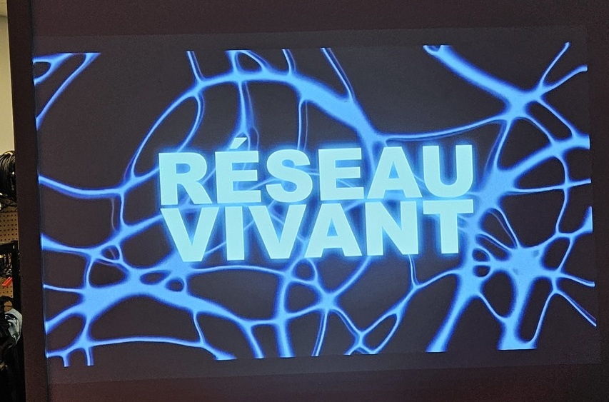
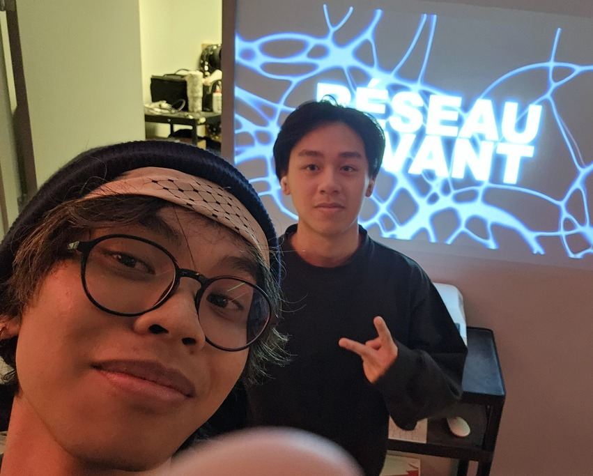
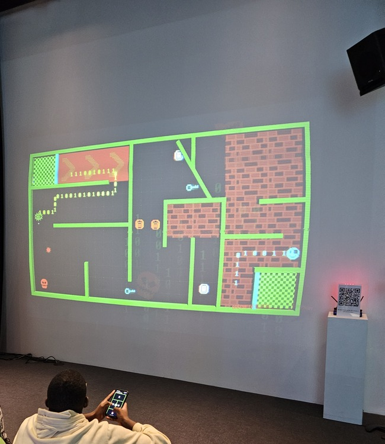
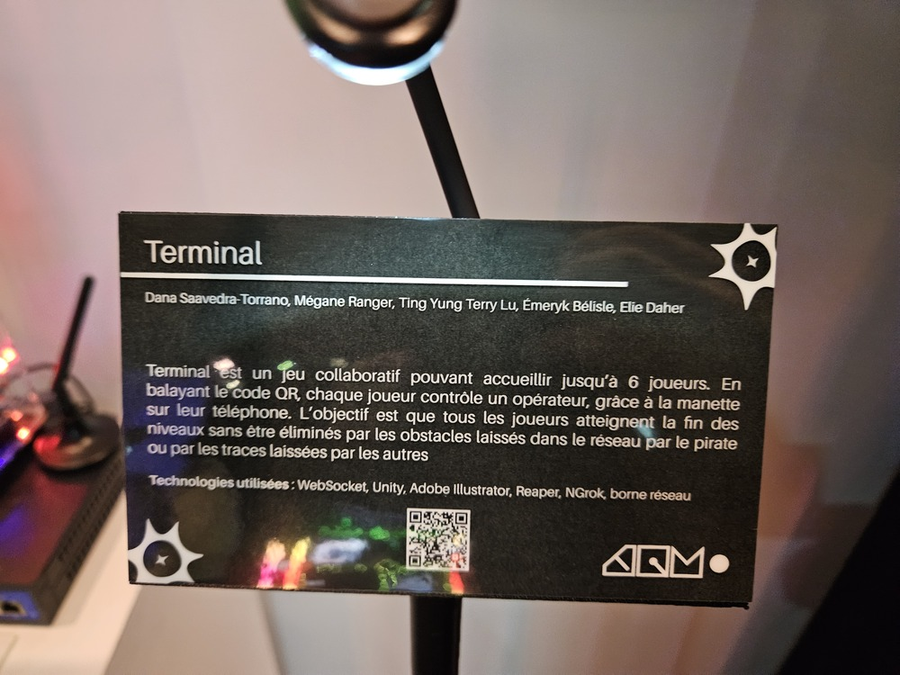
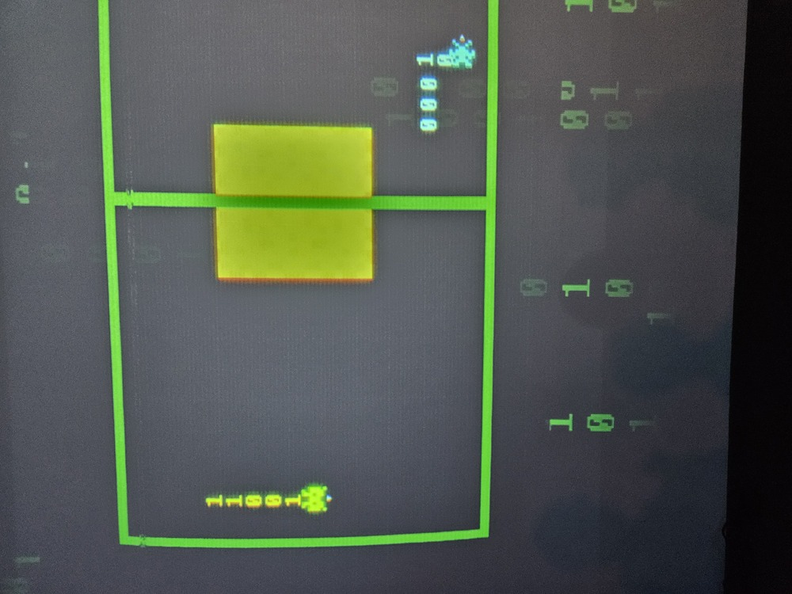
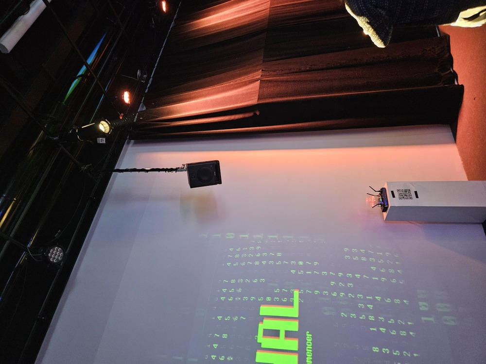
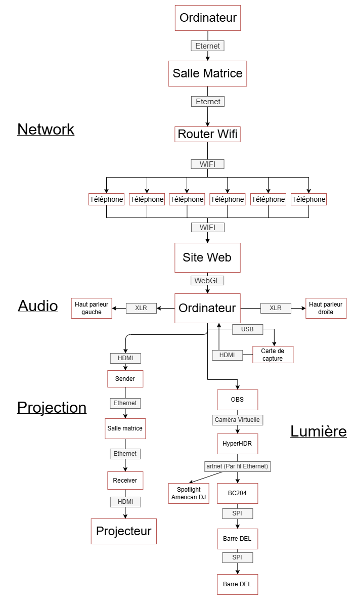

# Réseau vivant

---

### Lieu de mise en exposition

- Grand studio C-1712, Collège Montmorency, 475 Bd de l'Avenir, Laval, QC H7N 5H9

### Type d'exposition
- Temporaire et intérieur

### Date de visite
- 18 mars 2026

### Titre de l'oeuvre
#### - TERMINAL

### Nom des artistes
- Émeryk Bélisle
- Elie Daher
- Ting Yung Lu Terry
- Dana Saavedra-Torrano
- Mégane Ranger

### Année de réalisation
- 2026

---

### Description du dispositif
TERMINAL est une installation interactive pouvant accueillir jusqu'à 6 joueurs. Chaque joueur contrôle un opérateur via la manette sur son téléphone pour restaurer un ancien réseau informatique piraté par un pirate informatique. Lorsque les joueurs se déplacent, une ligne suit leur trajectoire et devient un obstacle pour les autres opérateurs. L'objectif est que tous les joueurs atteignent la fin des niveaux sans être éliminés par les obstacles laissés par le pirate ou les traces des autres. En cas d'élimination, toute l'équipe doit recommencer le niveau depuis le début. Au fur et à mesure de la progression, les niveaux deviennent de plus en plus complexes, introduisant des boutons qui ouvrent des passages, des obstacles mobiles et bien d'autres défis nécessitant communication et coordination. ¹

### Type d'installation
- Interactive

---

### Fonction du dispositif multimédia

---

### Mise en espace

###### ² Plan d'implantation 2D

---

### Composantes et techniques 

###### ³ Synoptique de Terminal

---

### Éléments nécessaires à la mise en exposition
- 6 poufs gonflable
- Podium avec code QR
- Fairy Lights
- Abonnement NGrok 2 mois

---

### Expérience vécue
En entrant dans le grand studio, les personnes lisent le cartel sur notre projet qui contient les instructions. Les joueurs devront se connecter sur le routeur et balayer le code QR pour entrer dans le jeu. Quand tous les joueurs auront appuyé sur prêt, l'écran affiche une courte intro et explique les bases en quelques secondes. La partie démarre au niveau 1, les joueurs réalisent vite qu'ils doivent communiquer, car quand ils se déplacent, une ligne permanente derrière leur opérateur devient un obstacle pour les autres. Si quelqu'un est éliminé, tout le monde recommence le niveau. Les joueurs apprennent par essais et erreurs. Plus ils avancent, plus les niveaux combinent de nouvelles mécaniques comme des portes et des obstacles qui bougent et montent en difficulté. ⁴

---

### Ce qui m'a plu, m'a donné des idées
J'aime la simplicité du dispositif. Les instructions sont intuitives et très faciles à suivre et j'ai trouvé le jeu amusant.

### Aspect que je ne souhaiterais pas retenir pour mes propres créations ou que vous feriez autrement
Je n'ai rien vraiment trouvé que je n'ai pas apprécié ou que je changerais. Je pense que le dispositif a été bien exécuté.

---

### Références

¹ Équipe Terminal de Montmorency, « Terminal », 2026, https://pythons-5.github.io/Terminal/#/?id=description

² Équipe Terminal de Montmorency, « Terminal », Plan d'implantation 2D et 3D, image.png 2026, https://pythons-5.github.io/Terminal/#/technique/?id=plan-dimplantation-2d-et-3d

³ Équipe Terminal de Montmorency, « Terminal », Synoptique, Synoptique.png, 2026, https://pythons-5.github.io/Terminal/#/technique/

⁴ Équipe Terminal de Montmorency, « Terminal », 2026, https://pythons-5.github.io/Terminal/#/concept/